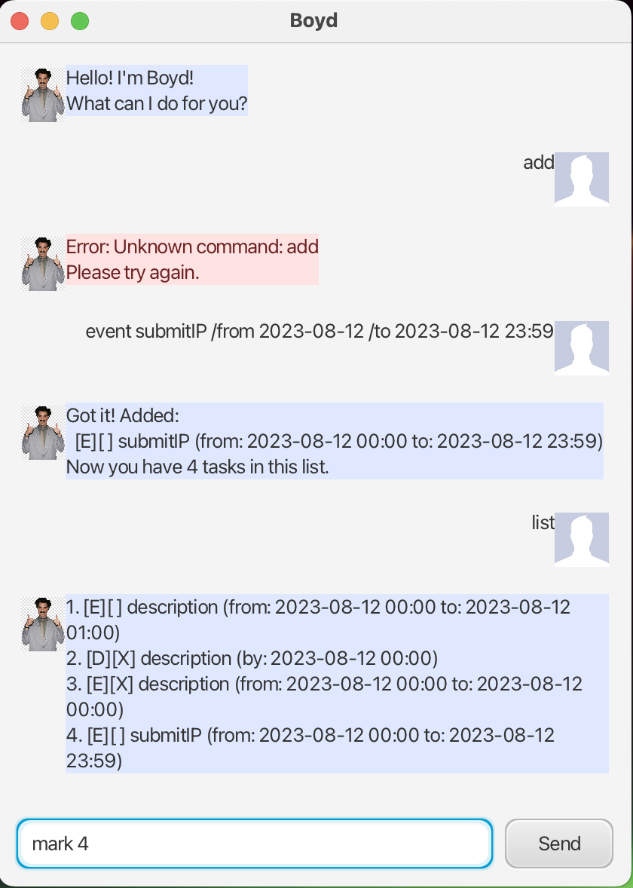

# Boyd User Guide

Boyd is a lightweight task chatbot. Type commands; Boyd replies instantly. Optimized for small windows and long replies.

## Quick Start
1. Install Java 17.
2. Run the app:
   - Gradle: `./gradlew run`
   - Jar: `./gradlew shadowJar && java -jar build/libs/boyd.jar`
3. Start typing in the input box, then press Enter or click Send.

## Features

### List tasks
- Shows all tasks with numbering.
- Command: `list`

### Add to-do
- Command: `todo DESCRIPTION`
- Example: `todo read book`

### Add deadline
- Command (date or datetime):
  - `deadline DESCRIPTION /by YYYY-MM-DD`
  - `deadline DESCRIPTION /by YYYY-MM-DD HH:mm`
- Prints with normalized datetime.
- Examples: `deadline return book /by 2019-12-02`, `deadline return book /by 2019-12-02 18:00`

### Add event
- Command (date or datetime for both ends):
  - `event DESCRIPTION /from YYYY-MM-DD[ HH:mm] /to YYYY-MM-DD[ HH:mm]`
- Date-only defaults time to 00:00.
- Example: `event CS2103T tutorial /from 2025-10-20 10:00 /to 2025-10-20 12:00`

### Mark as done
- Command: `mark INDEX`
- Example: `mark 2`

### Find tasks
- Case-insensitive substring search in the task text.
- Command: `find KEYWORD`
- Example: `find book`

### Delete task
- Command: `delete INDEX`
- Example: `delete 3`

### Exit
- Command: `bye`

## Notes
- Indexes are 1-based.
- Dates must be `YYYY-MM-DD`; datetimes `YYYY-MM-DD HH:mm` (24-hour).
- Data is saved to `./data/boyd.txt` automatically.

## Troubleshooting
- No window appears: ensure you run locally (not headless) and try `./gradlew clean run`.
- App won’t start after edits: delete `./data/boyd.txt` and try again.
